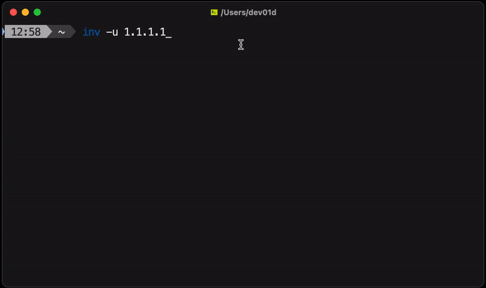

# Inv

A formatted investigation tool.

`inv` helps you `inv`estigate IPs/hosts and DNS records then returns the results in a copy/pasteable format.

## Usage

<p align="center">
    
</p>

```shell
Usage: inv [OPTIONS] COMMAND

-h, --help                   Show this help
-d, --dig=domain             Dig DNS records
-n, --nmap=target            Nmap port scan
-p, --ping=IP                Check liveness stats
-w, --whois=domain           Whois domain information
    --version                Print version
```

## Install

### Mac

via Homebrew:

```shell
brew install dev01d/tap/inv
```

## Linux

- APT

<!-- /* spellchecker: disable */ -->

```bash
curl -fsSL https://dev01d.fury.site/apt/gpg.key | sudo gpg --dearmor -o /usr/share/keyrings/dev01d.gpg
```

```bash
echo "deb [arch=$(dpkg --print-architecture) signed-by=/usr/share/keyrings/dev01d.gpg] \
 https://dev01d.fury.site/apt/ * *" \
| sudo tee -a /etc/apt/sources.list.d/dev01d.list > /dev/null
```

```bash
sudo apt-get update; sudo apt install inv
```

- YUM

```bash
sudo echo """\
[dev01d]
name=dev01d repo
baseurl=https://dev01d.fury.site/yum/
enabled=1
gpgcheck=0
""" > /etc/yum.repos.d/dev01d.repo

yum install inv
```

<!-- /* spellchecker: enable */ -->

### Alpine Linux

Download from [release page](https://github.com/dev01d/inv/releases)

### Windows

Download from [release page](https://github.com/dev01d/inv/releases)
